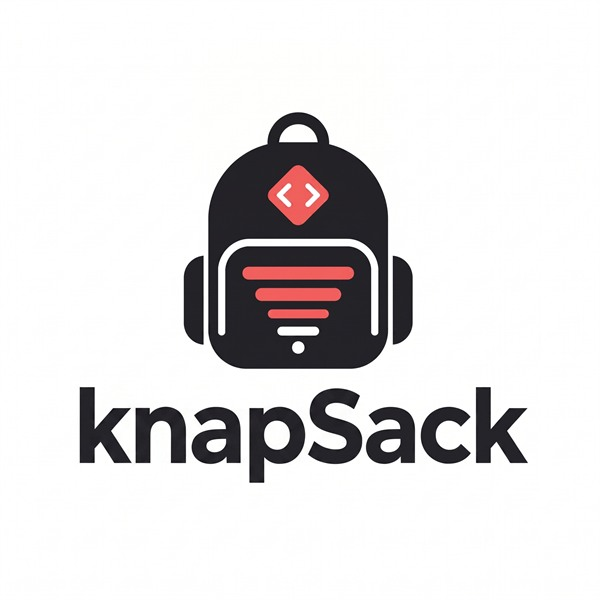

<p align="center">
  
</p>

# 🎒 Knapsack

**Stop paying for output Claude Code has already seen.**
Knapsack shrinks the noisy command output and file reads that flood your context window — so your tokens go to thinking, not re-reading. Nothing is lost: Claude can pull back the exact original any time.

[](https://github.com/MerlijnW70/knapsack/releases)
[](#license)


**[Install](#install) · [Why](#why-youll-want-it) · [How it works](#how-it-works) · [Commands](#commands) · [FAQ](#faq)**

---

## Install

One line. Restart Claude Code. Done.

**Windows (PowerShell)**
```powershell
irm https://raw.githubusercontent.com/MerlijnW70/knapsack/main/install.ps1 | iex
```

**macOS / Linux**
```sh
curl -fsSL https://raw.githubusercontent.com/MerlijnW70/knapsack/main/install.sh | sh
```

The installer downloads a tiny binary, verifies its checksum, **backs up** your Claude Code config, wires itself in, and runs a self-check. Then just **restart Claude Code** — that's it.

Verify it's live by typing `/knapsack` in Claude Code. You'll see:

```
Knapsack active

Input reduction:  active
Output reduction: active
Session saved:    no activity yet
Net reduction:    n/a
Recall:           idle
Store:            empty
```

If anything other than `Knapsack active` shows, run `/knapsack doctor` for a long-form diagnostic.

**Off-switch for the Read-tool path** (rare — only if it ever misbehaves):

```sh
KNAPSACK_READ_HOOK=0 claude    # disable input reduction for this session
```

Output reduction stays on. Unset the variable to re-enable.

<details>
<summary>Prefer to build it yourself?</summary>

```sh
git clone https://github.com/MerlijnW70/knapsack
cd knapsack
cargo build --release
./target/release/knapsack install
```
</details>

---

## Why you'll want it

Agents re-read the same files and re-run the same tests over and over. Every time, the **full output** gets dumped back into the context window — burning tokens (and money) on text Claude has already seen.

Knapsack quietly compresses both **command output** and **file reads** as they come in. When Claude actually needs a detail, it asks for the exact bytes back.

- 💸 **~90% fewer tokens** on the repeated reads and edit→test loops agents do most (measured on this repo: 88% cold, 99% warm across 25 real commands).
- 🔒 **Nothing is lost.** Recall is byte-exact — character for character, every time.
- ⚡ **Invisible.** It runs as a Claude Code hook. Install once, then forget it's there.
- 🛟 **Never worse than raw.** If a compressed view wouldn't be smaller, knapsack lets the raw bytes through — it can never make a turn more expensive.
- 🪶 **Tiny & safe.** One small binary, zero runtime dependencies, and it backs up your config before touching anything.

---

## How it works

Knapsack runs as a Claude Code hook on two paths:

- **Output reduction** — when Claude runs a noisy Bash command (`cargo test`, `npm install`, `git diff`, …) its output goes through Knapsack first. The model sees a compact summary plus a recall handle.
- **Input reduction** — when Claude reads a large file (a long source file, a packed log, a big markdown doc), the model sees a compressed view of it instead of the raw bytes. The original file on disk is never touched.

Either way, if the model needs the details it can **expand the handle** byte-exact (whole file, a line range, or a grep). And re-running or re-reading the same thing is nearly free — Knapsack just emits a small back-reference.

> The first time something is seen, it's sent in full. Every repeat after that is nearly free.

Knapsack only intervenes when it helps. If a compressed view isn't meaningfully smaller than the raw bytes, the raw bytes go through unchanged — the tool can never make a turn *more* expensive than not running it.

---

## What you get

- **Automatic compression** of noisy command output, the moment it runs.
- **On-demand recall** — Claude fetches the full output, a line range, or a search match, byte-exact.
- **A live savings scoreboard** — run `knapsack metrics` any time to see tokens saved.
- **Cross-platform** — Windows, macOS (Intel & Apple Silicon), and Linux.

---

## Commands

| Command | What it does |
| --- | --- |
| `knapsack` (or `/knapsack` in Claude Code) | The friendly summary — active? tokens saved this session? recall healthy? |
| `knapsack pack <file>` | Pack a context file (CLAUDE.md, AGENTS.md, briefs) — writes `<name>.knapsack.md` next to it, original untouched. `--dry-run` to inspect, `--force` to write even when savings are tiny, `--output <path>` to override. |
| `knapsack doctor` | Long-form health check — confirms the hook and MCP server point at the same installed binary, reports store metadata coverage |
| `knapsack metrics` | Detailed metrics scoreboard |
| `knapsack gc [--older-than DAYS] [--dry-run]` | Drop cold blocks from the recall store (default: 30 days). Removes block + metadata sidecar as a pair. Also cleans the experimental read-cache. |
| `knapsack why-last [N]` | Print the last N Read-hook decisions (default 10) — "why was this Read redirected / passed through?". Useful when a specific file isn't getting compressed. |
| `knapsack uninstall` | Cleanly removes it (add `--purge` to also delete its cache) |

### Input reduction (Read tool) — safety contract

Input reduction is on by default after `knapsack install`. When the model issues a Read of a large file, the PreToolUse hook decides whether to redirect at a compact view in `~/.knapsack/read_cache/`. The decision is conservative on purpose:

- **Never mutates the original file** — the source on disk is read-only to the hook. The redirect only changes which path Claude Code reads.
- **Passes through on any uncertainty** — missing file, unreadable file, slicing (`offset` / `limit`) reads, files outside the safety band (under 8 KB or over 4 MB) all bypass the hook untouched.
- **Refuses to redirect if not enough is saved** — if the compressed view doesn't beat the raw file by a clear margin, the original is read directly.
- **Recall is byte-exact** — `knapsack expand <handle>` (or the `knapsack_expand` MCP tool) returns the original bytes, character-for-character, or a `--lines A-B` slice.
- **Every decision is logged.** `knapsack why-last 20` shows the reason for the last 20 Reads — useful when a file you expected to be compressed wasn't.
- **Off-switch:** `KNAPSACK_READ_HOOK=0 claude` disables it for that session. Output reduction stays on.

### `knapsack pack <file>` — safety contract

- **Never mutates the original file.** The packed view is written to a side-car (default `<name>.knapsack.md`).
- **Refuses to write a non-shrinking view** unless `--force` is passed. `--dry-run` writes nothing and just reports what *would* happen.
- **Byte-exact recall.** The original bytes are stored under a content-addressed handle; `knapsack expand <handle>` (or the `knapsack_expand` MCP tool) returns them character-for-character, or a `--lines A-B` slice.
- **No prompt or tool-input mutation.** This is an explicit, user-invoked operation — Knapsack never silently rewrites prompts or hidden context.

### What a packed file looks like

The visible markers are short and human-readable:

```
[Knapsack: section omitted · ~178 tokens · exact recall available]
```

Handles and line ranges live in a trailing HTML comment that markdown renderers strip, so the rendered file stays clean. **Normal users** just read the side-car as-is — the original is always one `knapsack expand <handle>` away.

**Power users** can run `knapsack inspect <packed-file>` to see the per-section index:

```
Knapsack packed view: CLAUDE.knapsack.md
  original source: CLAUDE.md
  whole-file handle: ks_1f5d1077f2
  full recall: knapsack expand ks_1f5d1077f2
  elisions: 3

  #1   lines 10-10   ~178 tokens   recall: knapsack expand ks_1f5d1077f2 --lines 10-10
  #2   lines 22-22   ~412 tokens   recall: knapsack expand ks_1f5d1077f2 --lines 22-22
  #3   lines 38-38   ~92 tokens    recall: knapsack expand ks_1f5d1077f2 --lines 38-38
```

> `knapsack install` (run for you by the installer) is what wires it into Claude Code.
> If `doctor` ever reports drift, `knapsack install --repair` re-points the hook and MCP server back at the installed binary.

---

## FAQ

**Will it lose any of my output?**
No. Recall is byte-exact — Claude can always get the original back, character for character.

**Will it mess up my Claude Code config?**
It backs up your `settings.json` and `~/.claude.json` before making any change, and `knapsack uninstall` reverses everything cleanly.

**Do I need to do anything after installing?**
Just restart Claude Code so it picks up the new hook.

**What does it need to run?**
Nothing extra — it's a single self-contained binary with zero runtime dependencies.

**How do I remove it?**
```sh
knapsack uninstall          # remove it, keep the cache
knapsack uninstall --purge  # remove it and delete the cache
```

---

## License

MIT — free to use, modify, and share.
